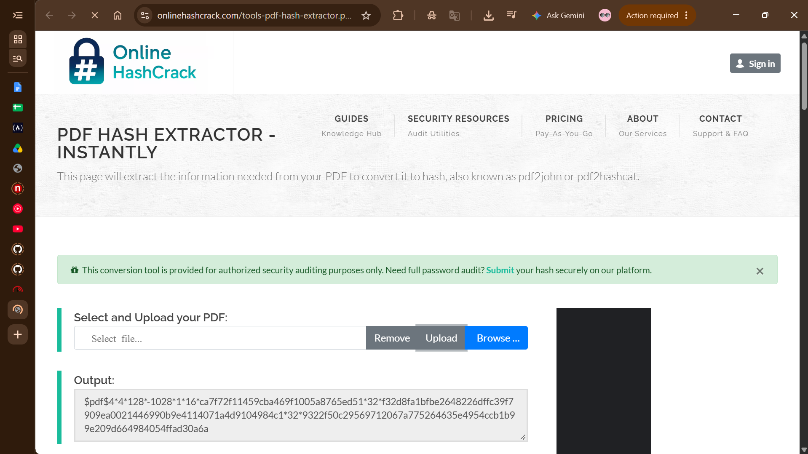
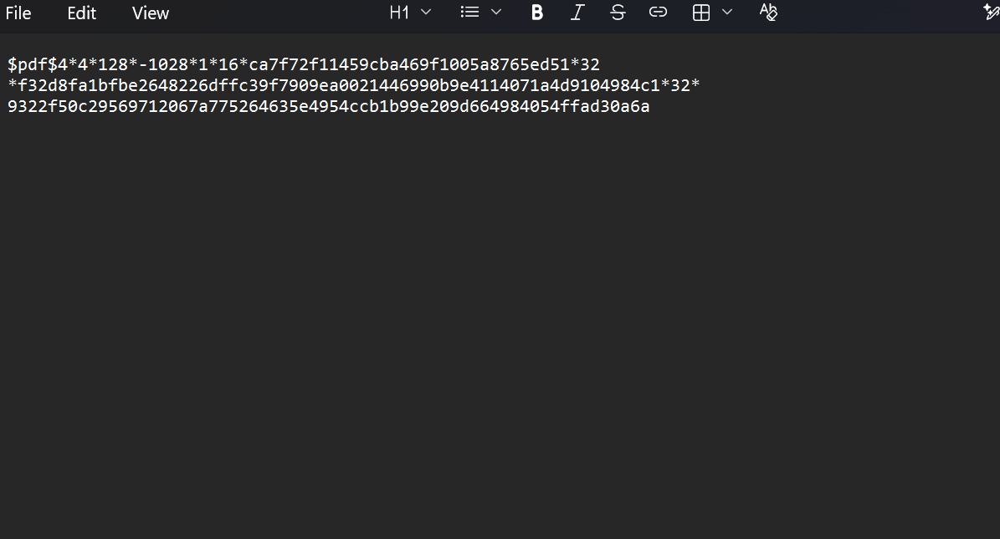

# 🔐 PM1 - Cracking a Password-Protected PDF with John the Ripper (JTR)
 
## 📋 Overview
 
This module walks through recovering the password on a locked PDF file using **John the Ripper (JTR)**, operated through its graphical interface, **Johnny**, on Windows. The exercise involved pulling a hash out of the encrypted PDF, feeding that hash into JTR, and cracking it to reveal the original password.
 

 
## 🎯 Objective
 
- Understand how a password-protected PDF stores its protection internally as a hash
- Extract that hash using a PDF-to-hash conversion tool (pdf1 john)
- Run a cracking attack against the extracted hash using John the Ripper via the Johnny GUI
- Recover the plaintext password and capture the module's flag
## 🛠️ Tools & Environment
 
| Tool | Purpose |
|------|---------|
| John the Ripper (JTR) | Core password-cracking engine |
| Johnny | Graphical front-end for JTR |
| OnlineHashCrack.com PDF Hash Extractor | Web-based pdf2john tool for pulling the hash out of the PDF |
| Notepad | Used to store the extracted hash locally |
| OS | Windows |
 
**Target file:** `My Locked PDF1.pdf` (password-protected PDF supplied for the lab)
 
## 🔍 Methodology
 
### 1️⃣ Figure out the hash format
 
A password-protected PDF doesn't store the password itself — it stores a hash that reflects the encryption method and its parameters. Before JTR can attempt to crack it, that protection needs to be pulled out in the pdf2john format it recognizes.
 
### 2️⃣ Pull out the hash
 
Instead of setting up a local Python/Perl environment, I used the browser-based **OnlineHashCrack PDF Hash Extractor** (onlinehashcrack.com/tools-pdf-hash-extractor.php), which runs pdf2john behind the scenes.
 
- Uploaded `My Locked PDF1.pdf` to the tool
- Got back a hash string in the standard `pdf...` format

 
> ⚠️ **A note on trust:** Sending a file to a third-party web tool means its contents leave your machine and go to an external server. This particular tool states it deletes uploads immediately without storing them, which made it fine for a training exercise — but this shortcut isn't something you'd want to rely on for sensitive or real-world documents. In an actual engagement, run `pdf2john.pl` locally instead.
 
### 3️⃣ Store the hash for cracking
 
Copied the extracted hash into a local text file, `hash1.txt`, so it could be fed straight into Johnny.
 

 
### 4️⃣ Load the hash into Johnny
 
- Opened Johnny (the JTR GUI)
- Used **Open password file** to load `hash1.txt`
- Johnny picked up on the format automatically and identified it as a PDF hash
### 5️⃣ Launch the attack
 
- Kicked off **Start new attack**
- Johnny/JTR ran its default cracking mode (a wordlist/dictionary-based attack) against the loaded hash
### 6️⃣ Password cracked
 
The attack finished with a **100% success rate (1/1 cracked, 0 remaining)**.
 

 
| User | Password | Hash (truncated) | Format |
|------|----------|-------------------|--------|
| ❓ | good-luck | `$pdf$4*4*128*-102...` | PDF |
 
### 7️⃣ Open the PDF and grab the flag
 
Using the cracked password to unlock `My Locked PDF1.pdf` revealed **Flag1** for this module.
 

 
## 🧠 Key Takeaways
 
- A password-protected PDF's encryption can be converted into a crackable hash using pdf2john, regardless of what's actually inside the document
- John the Ripper (through Johnny) can auto-detect the hash type and pick a suitable cracking approach without needing manual setup
- Simple, dictionary-style passwords — even short phrase-like ones — fall quickly to a basic wordlist attack, which is a good reminder of why strong, random passphrases matter for protecting documents
- Web-based conversion tools are handy for practice labs, but the privacy trade-off they introduce makes them a poor fit for real, sensitive files
 
